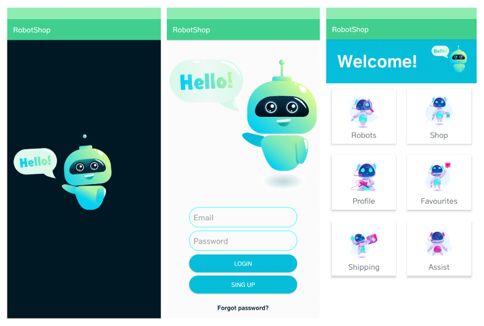

<div align="center">
  
  
  
  
  
  
  
  
  
  
  
  
  
  
  
  

  <h2 align="center">RobotShop. Tienda de robots para Android 🤖</h2>

Aplicación para Android hecha con Kotlin y base de datos en Firebase.
  
### 📸 Captura de pantalla de demostración
  
</div>



<br/>

### ⭐ Prerequisítos

Antes de comenzar, asegúrate de haber cumplido con los siguientes requisitos:

* [Git](https://git-scm.com/downloads "Descargar Git") debe estar instalado en su sistema operativo.

### 🚀 Ejecutar el proyecto localmente

Para ejecutar **Robotshop** localmente, ejecuta este comando en tu git bash o terminal:

Linux y macOS:

```bash
sudo git clone https://github.com/GeralNo/app-robotShop.git
```

Windows:

```bash
git clone https://github.com/GeralNo/app-robotShop.git
```

### 📫 Contácto

Si quieres contactárme puedes escribirme en [email](mailto:geraldinenovoa2709@gmail.com).

### 📃 Licencia

Este proyecto contiene una licencia: **MIT License**.